# Arabic-NLP-Text-Stance-And-Classification
NLP Python code that calculates stance and classifies Arabic tweets about COVID-19 vaccination.

<!--

-->

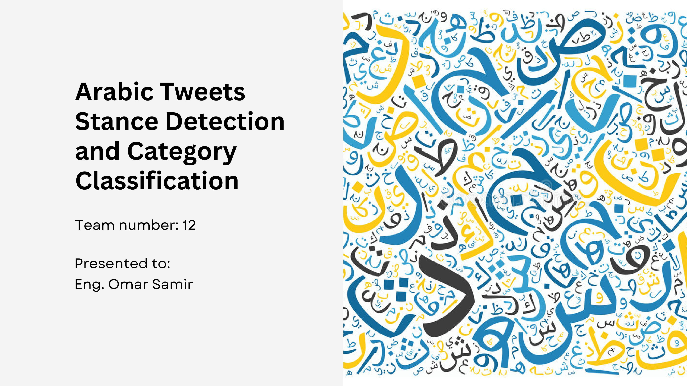
---
## Pipeline
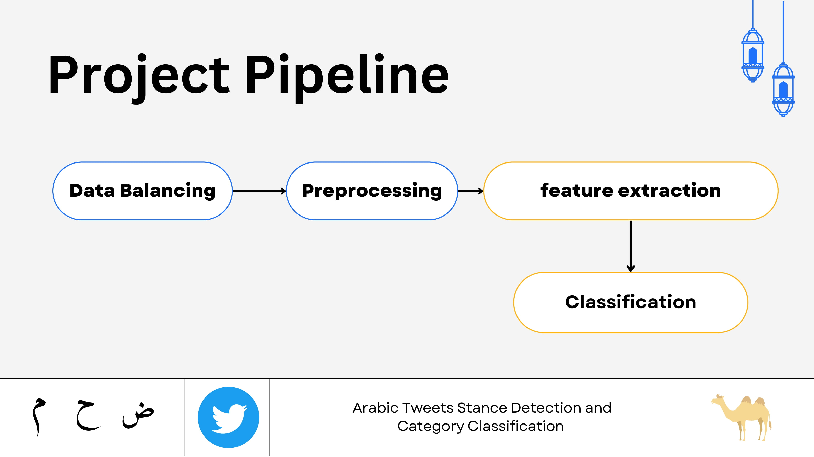
---
## Data
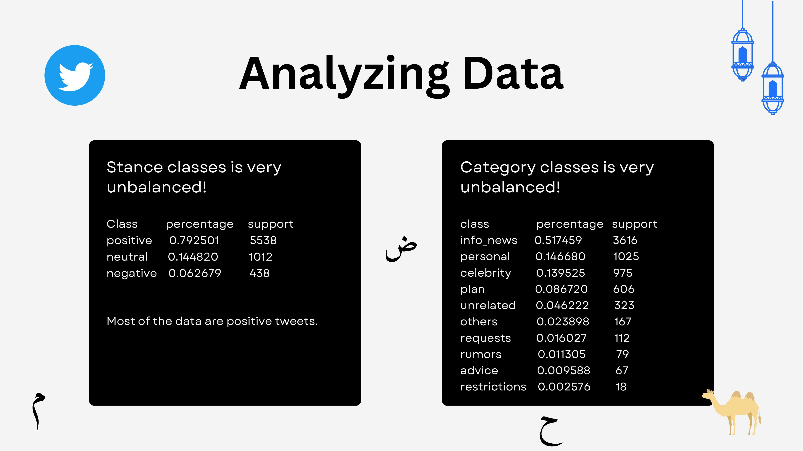

### Data Balancing
Problem was un-avoidable as unlike 'accuracy', 'macro f1' score will just collapse when we ignore some very low probabilty classes.
We implemented two approaches:
1. **Oversampling**

   More samples for minoriy classes, using `class_weight='balanced'` in [`scikit-learn`](https://scikit-learn.org/) classifiers.
2. **Penalizing mistakes**

   Higher penalty for minority classses, using [`imblearn`](https://pypi.org/project/imblearn/).

### Data preprocessing:
We used `regex`, [`camel-tools`](https://github.com/CAMeL-Lab/camel_tools), [`farasapy`](https://github.com/MagedSaeed/farasapy), [`Arabic-Stopwords`](https://pypi.org/project/Arabic-Stopwords) and [`nltk`](https://github.com/nltk/nltk)
1. Removing Diacritization (التشكيل) and punctuation.
2. Replacing links, numbers and mentions with <link>, <num> and <mt>.
3. Converting emojis to equivalent text. (😂 -> face_tearing_with_joy)
4. Normalizing letters. `أ إ آ  -> ا`
5. Lemmatization using multiple tools.
6. Converting English text to lowercase.
7. Repeating hashtag words `n` times.
8. Removing stopwords. (combined `nltk` and `Arabic-Stopwords`) e.g. 'وأيها' , 'عندنا' , 'معي'.
9. Removing duplicate rows.
10. Tokenization using `camel-tools` simple word tokenizer.

#### Additional Ideas:
1. Translate English text.
2. Do everything in Arabic. (emoji meanings, tokens, english text translation, …)
3. Remove numbers or convert to word representation.
4. Better stop words datasets, can also remove too rare / too frequent words.
5. Named entity recognition. (NER)
---
## Feature Extraction
* Bag of words (BOW)
* TF-IDF
   * We used both Word `n-grams` and Character `n-grams`.
* Continuous BOW Word2Vec
* Skip-gram Word2Vec
* Arabert Embeddings as a feature for SVM
   * We took the `pooler output` from Bert, which resemble embeddings and feed them to SVM as a feature.
---

## Models
### Classical Models
  * SVM
  * Naive Bayes
  * KNN
  * Decision Trees
  * Random Forest with `n_estimators = 1000`
  * Logistic Regression with `n_iterations = 300`

#### Some Results for Stance Detection
Best results was:
Preprocessing | Features | Classifier Model | Acc | F1
--- | --- | --- | --- | ---
Farasa lemmatize + dediacritized camel lemmatize + original text | TFIDF char + word | Linear SVM | 80 | 56

Other results:
Features | Classifier Model | Acc | F1
--- | --- | --- | ---
BOW | Naive Bayes | 56 | 42
BOW | Logistic Regression | 77 | 55
BOW | Random Forest | **80** | 46
BOW | Linear SVM | 76 | 51
CBOW | Ridge Classifier | 73 | 38
S-Gram | Ridge Classifier | 80 | 40
---
### Sequence Models
In the sequence models family, we’ve built a 3-layer LSTM followed by a linear neural network layer.

LSTM’s Training Settings:
Epochs | Batch Size | Learning rate | Embedding Dimension | LSTM Hidden layers Dimension
--- | --- | --- | ---- | ----
50 | 256 | 0.001 | 300 | 50

Best result on **Categorization** problem:
Data | Features | Classifier Model | Acc | F1
--- | --- | --- | --- | ---
Oversampled data | Embedding Layer | 3-layer LSTM + 1 NN layer | 56.6 | 25.9
---
### AraBert (Transformers)
[source](https://github.com/aub-mind/arabert)

  
  
  

In the transformers family, we’ve fine-tuned an Arabic bert model on our dataset.
* The arabic bert used was aubmindlab/bert-base-arabertv02-twitter from hugging face. We’ve chosen this model because it was trained on ~60 Million Arabic tweets.
* As per the documentation, we’ve used the preprocessing and tokenizer that was used when the model authors built their model.
Fine-tuning:
* We use the AraBert as a feature extractor, by first freezing the bert’s parameters, then passing the data through this arabert model, and producing the embedding as output. The sentence embedding is calculated by taking the last layer hidden-state of the first token of the sequence `CLS token`.
* Then the sentence embeddings enters a classifier head we’ve built. The classifier head consists of 2 neural network layers in order to fine tune the weights of the model on our data.
* Arabert Training Settings:

   Epochs | Batch Size | Learnign rate
   --- | --- | ---
   50 | 16 | 0.001
* Arabert embeddings with SVM classifier:

   Extract sentences’ embeddings using arabert, then train these embeddings using a linear-kernel SVM.
---
## Final Results
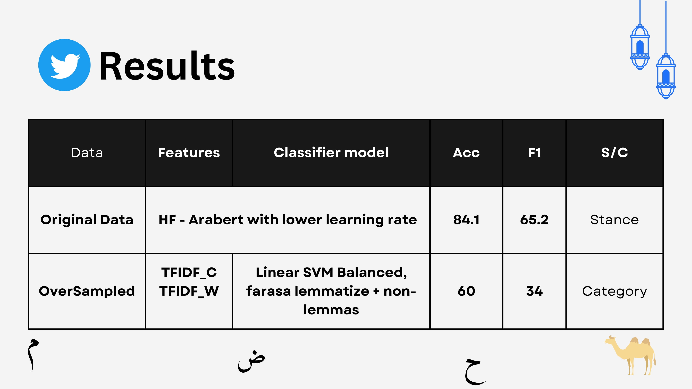

<!-- 
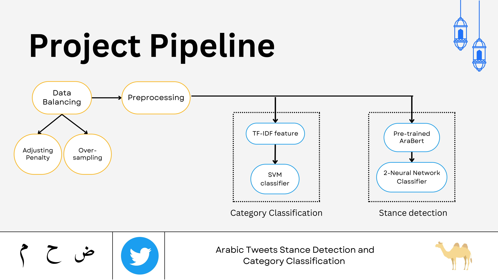

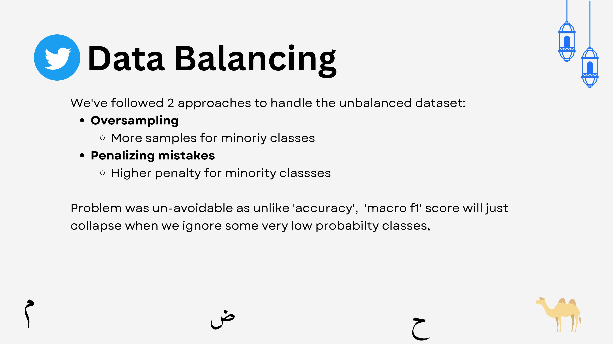
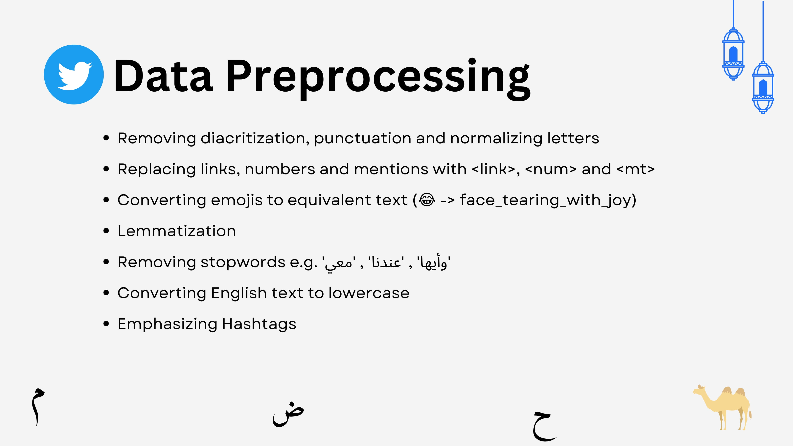
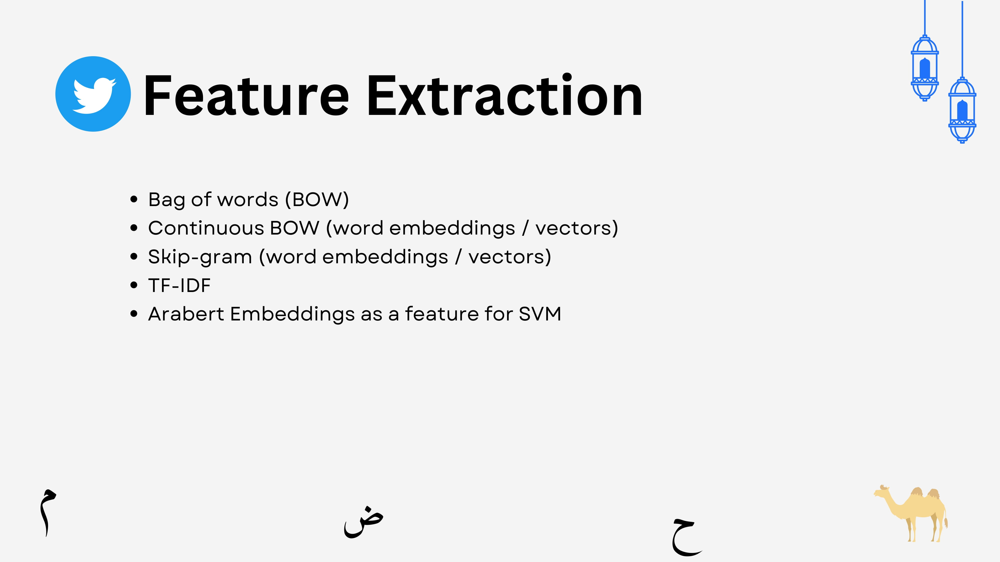
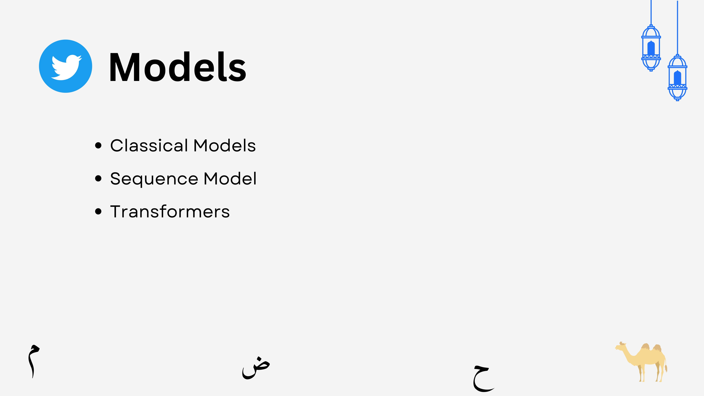
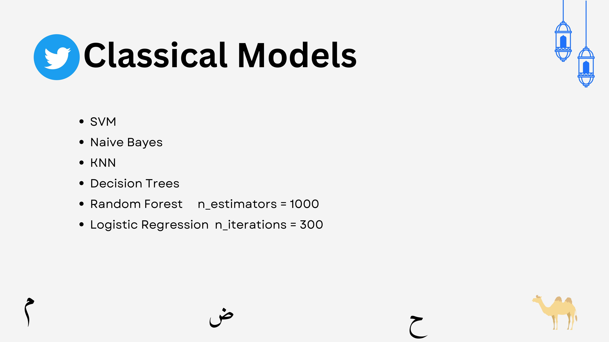
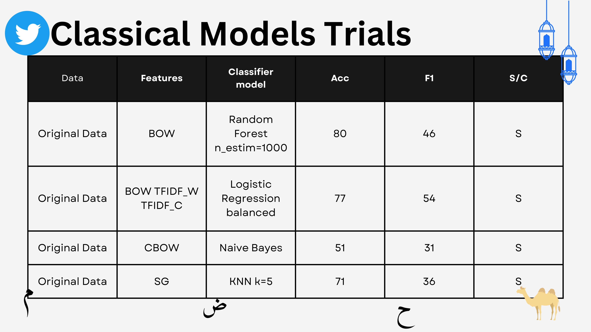
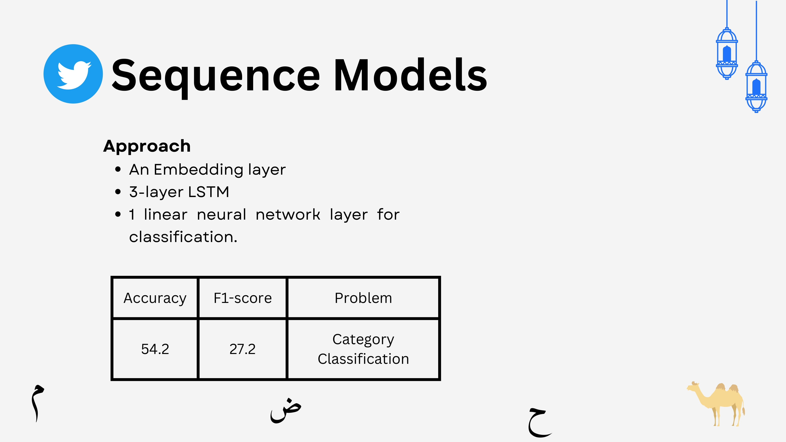
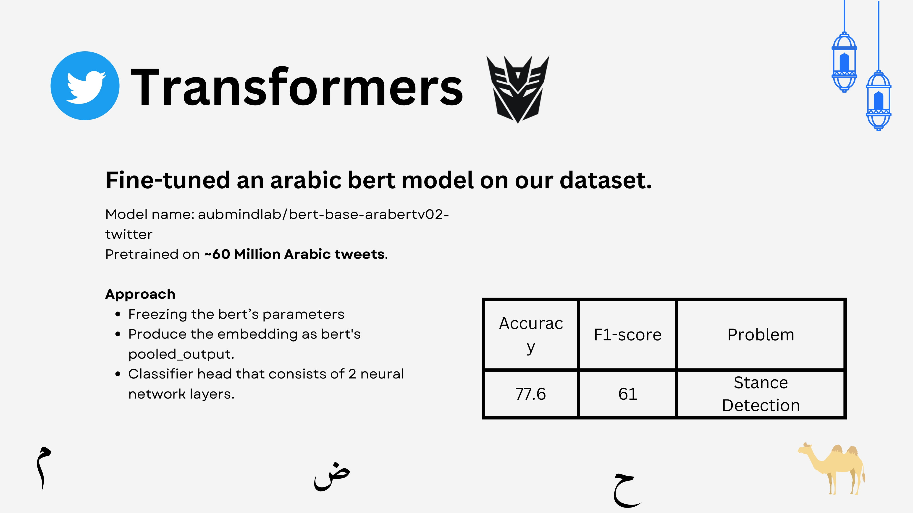

-->
### Libraries Used
+ `nltk`
+ `Arabic-Stopwords`
+ `camel-tools==1.2.0`
+ `farasapy`
+ `arabert`
+ `pandas`
+ `scikit-learn`
+ `gensim`
+ `Transformers`
+ `imblearn`
---
## تم بحمدالله

